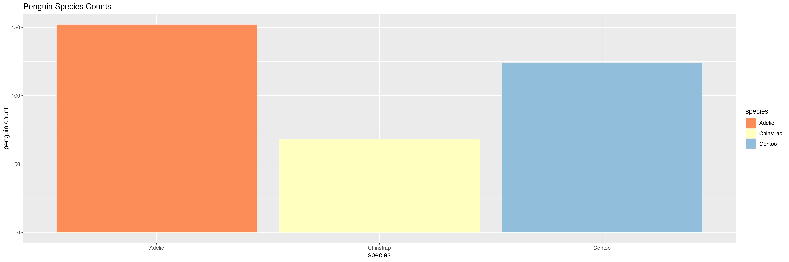
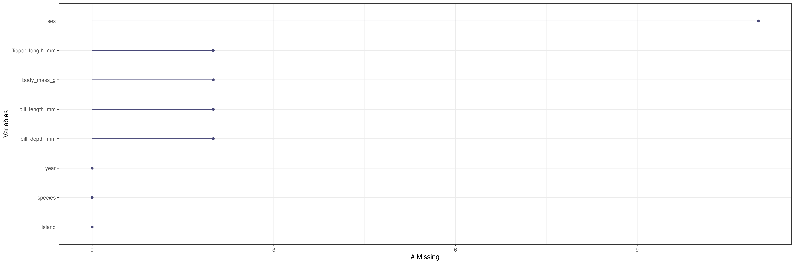
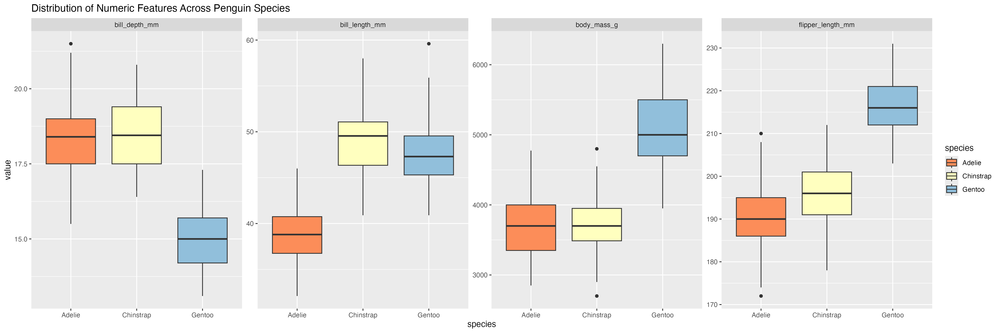
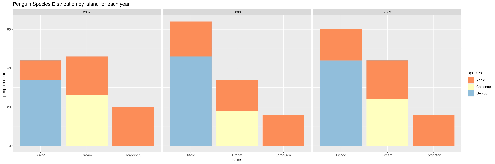
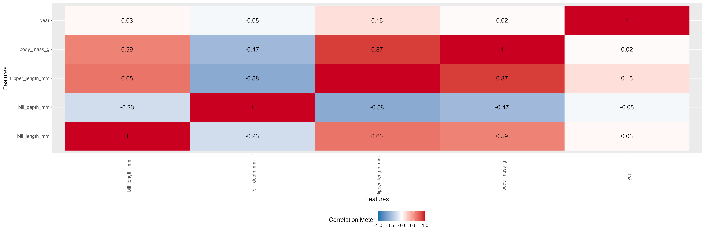

# Analyzing and Visualizing Penguin Data with ggplot
### Summary
In this notebook, I leverage the data analysis and visualization techniques using `ggplot`, I explore and uncover insights from the palmerpenguins dataset through compelling visualizations.

### Background
The palmerpenguins dataset is a collection of data about penguins from the Palmer Archipelago in Antarctica. It was created by researchers from the Palmer Station, Antarctica, which is part of a long-term ecological research project. The dataset contains measurements on three species of penguins: Adélie, Chinstrap, and Gentoo. It includes variables such as species, island location, bill length, bill depth, flipper length, body mass, and sex.

## Project Overview: Analyzing the Palmer Penguins Dataset
Below is a high-level walkthrough of the key components of the analysis, each paired with select visualizations that illustrate the most compelling insights.

### Dataset Overview
Introduces the dataset's structure, variables, and the three penguin species being studied. This dataset includes the Adelie, Chinstrap, and Gentoo species of penguins and variables like bill length, flipper length, and body mass.

*Bar chart showing the number of penguins per species.*


### Data Cleansing and Preprocessing
Details how missing values and inconsistent data were handled to prepare the dataset for analysis. After handling missing values, I retained 333 complete cases for analysis.

*Visualization of missing data patterns before cleaning.*


### Exploratory Analysis
Provides initial visual and statistical insights into the distributions and relationships within the data. The distribution of measurements were examined to understand variability across species.

*Visualization showing how key physical characteristics differ across each penguin species.*


### Temporal and Geographic Distribution
Examines how penguin species vary by island and year, highlighting spatial and temporal trends.

*Visualization showing penguin species across each island for all three years observed.*


### Correlations
Identifies and visualizes relationships between key numerical features such as body mass and flipper length.

*Heatmap showing correlations among numerical variables.*


### Summary of Findings
Summarizes the most important insights discovered throughout the analysis, with a focus on species and measurement differences.

## Running the Notebook Locally
To explore the analysis on your own machine, follow the steps below to install the required packages and set up Jupyter with R support.

### Packages
Before running the notebook, make sure the following R packages are installed:
- palmerpenguins
- ggplot2
- tidyverse
- corrgram
- DataExplorer
- naniar

You can install them all at once with:
`install.packages(c("palmerpenguins", "ggplot2", "tidyverse", "corrgram", "DataExplorer", "naniar"))`  
This is also included at the top of the Jupyter notebook.

### Setting Up Jupyter with R
1. Install Jupyter
If you're on a Mac, the easiest way is through Homebrew:
`brew install jupyter`

2. Start Jupyter Notebook
Navigate to the project directory in your terminal and run:
`jupyter notebook`  
This will launch Jupyter in your default browser at http://localhost:8888.

3. Install the R Kernel
To run R code within Jupyter notebooks, install the IRKernel from R:
```
install.packages("IRkernel")
IRkernel::installspec(user = TRUE)  # this installs the kernel for Jupyter
```
Once complete, you should see R as an available kernel in the Jupyter interface.
